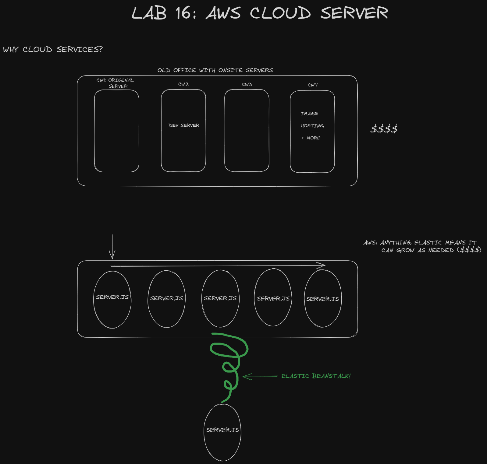

# LAB - Class 16

## Project: cloud-server

### Author: Ryan Eastman

### Problem Domain

The goal for today is to deploy a simple Node.js server to EC2, using Elastic Beanstalk.

1. **Choose a server you’ve built previously**:
   - Option 1: A simple API or Web Server
   - Option 2: A socket.io event Hub
The server should not require a database.
Check in your server to GitHub.

2. **Task 1**:

   - Create a new environment, using Elastic Beanstalk from the AWS Control Panel (GUI)
   Manually deploy your application to this environment by uploading a .zip file

3. **Task 2**:

   - Using the same server, create a new environment using Elastic Beanstalk from your terminal
Manually deploy your application to this environment by using eb deploy

### Links and Resources

- [GitHub Actions ci/cd](https://github.com/DocHolliday13x/cloud-server/actions)
<!-- - [back-end server url](http://xyz.com) (when applicable)
- [front-end application](http://xyz.com) (when applicable) -->

### Collaborators

- Ryan Gallaway
- Reece Renninger
- Ike Steoger
- Stephen Clemmer

### Setup

#### `.env` requirements (where applicable)

for now I have none and do not require one

#### How to initialize/run your application (where applicable)

- e.g. `npm start`

#### How to use your library (where applicable)

#### Features / Routes

- Feature One: Details of feature
- GET : `/hello` - specific route to hit

#### Tests

- How do you run tests?
- Any tests of note?
- Describe any tests that you did not complete, skipped, etc

#### UML

- 
